<div align="center">

<br />

<sub>` ⸺  展 覧 会 · 第 二 十 四 番  ⸺ `</sub>

# 君に届け

### From Me to You — A Digital Exhibition

_A quiet, editorial homage to the manga & anime_ **Kimi ni Todoke** _by Karuho Shiina._

`⸺  一 期 一 会  ⸺`

<sub>*Ichi‑go ichi‑e* · one time, one meeting · treat every encounter as unrepeatable.</sub>

<br />

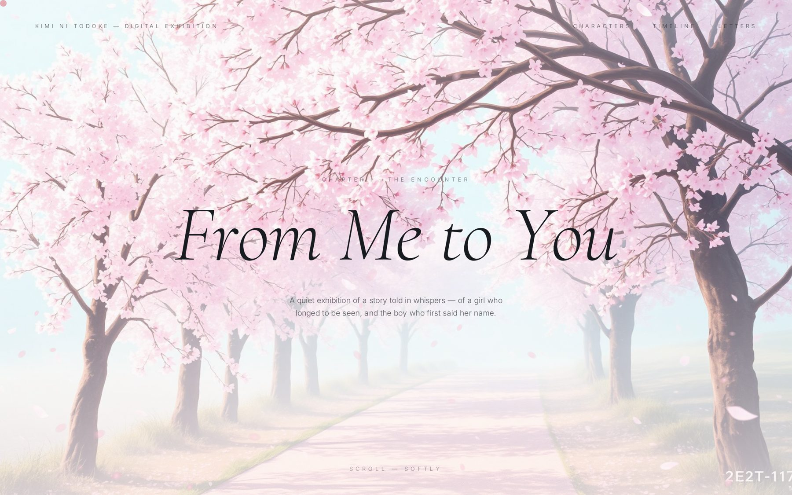

<br />

[](https://react.dev)
[](https://tanstack.com/start)
[](https://vite.dev)
[](https://tailwindcss.com)
[](https://motion.dev)
[](https://www.typescriptlang.org)
[](https://tanstack.com/start)

<sub>― _Designed & built with a slow hand._ ―</sub>

</div>

<br />

---

## 序 — Prologue

> _「普通の女の子になりたい。」_
> _"I only wanted to be an ordinary girl."_ — 黒沼 爽子

**From Me to You** is not a fan page.
It is a **curated digital museum** — an *aesthetic exhibition* built as a single, continuous scroll — dedicated to the slow, painterly love story between **Sawako Kuronuma (黒沼 爽子)** and **Shota Kazehaya (風早 翔太)**.

Every scroll is a room. Every section is a plate.
Typography breathes. Petals drift with the cursor. An *ensō* is drawn in one breath.
Nothing shouts. Everything reaches.

<br />

<div align="center">

```
    序          一          二          三          四
  Prelude   Encounter  Portraits    Ensemble    Quiet
    │          │          │           │           │
    ●──────────●──────────●───────────●───────────●
                                                  │
                                          五 · Original Ink
                                                  │
                                                  ●
                                                 ...
                                                  │
      十三 · Letters ● ─ ─ ─ ─ ─ ─  If this reaches you.
```

</div>

<br />

## 目次 — Table of Contents

|   | Chapter | Component | Motion / Technique |
|---|---|---|---|
| **序** | Prelude — 予兆 | `Prelude.tsx` | Shoji panels slide, kanji blooms |
| **一** | The Encounter — 出会い | `Hero.tsx` | Per-character stagger blur + canvas petals |
| **二** | Portraits — 肖像画 | `Characters.tsx` | Scroll-linked `useTransform` per portrait |
| **三** | The Circle — 群像 | `Ensemble.tsx` | Cinematic scale + opacity reveal |
| **四** | Quiet Moments — 静けさ | `Gallery.tsx` | Asymmetric editorial grid |
| **五** | Projection Room — 映写 | `HorizontalCinema.tsx` | Vertical scroll → horizontal film rail |
| **六** | Original Ink — 原画 | `MangaPanels.tsx` | Scroll-driven rotation + translate |
| **七** | Haiku Interlude — 俳句 | `HaikuInterlude.tsx` | Vertical-rl bilingual verse |
| **八** | Confession — 告白 | `ConfessionScene.tsx` | Pinned scene, breath-timed reveal |
| **九** | Two Weathers — 二季 | `SeasonsDiptych.tsx` | Spring · Winter diptych |
| **十** | Postal Archive — 手紙 | `Postcards.tsx` | 3D cursor-tilt springs, shine sweep |
| **十一** | The Thread — 縁 | `Timeline.tsx` | Scroll-drawn chronology |
| **十二** | Audio Signature — 音 | `AudioSignature.tsx` | 64-bar SVG spectrogram of silence |
| **十三** | Ensō — 円相 | `InkConstellation.tsx` | Sumi-e circle drawn in one breath |
| **十三** | Ensō — 円相 | `InkConstellation.tsx` | Sumi-e circle drawn in one breath |
| **十四** | Kintsugi — 金継ぎ | `Kintsugi.tsx` | Gold veins heal a fractured bowl |
| **十五** | Silent Dictionary — 言葉 | `KanjiGlossary.tsx` | Eight kanji · hover-reveal poem |
| **十六** | Text Mask — 届 | `TextMaskReveal.tsx` | SVG mask cuts kanji through film |
| **十七** | Letters Untold — 手紙 | `Letters.tsx` | Handwritten envelope closing |

<br />

---

## 展示 — Selected Plates

<br />

<table>
<tr>
<td width="50%" valign="top">

### 二 · Portraits — 肖像画
<sub>*Four characters. Four watercolour plates. Four whispered monologues.*</sub>

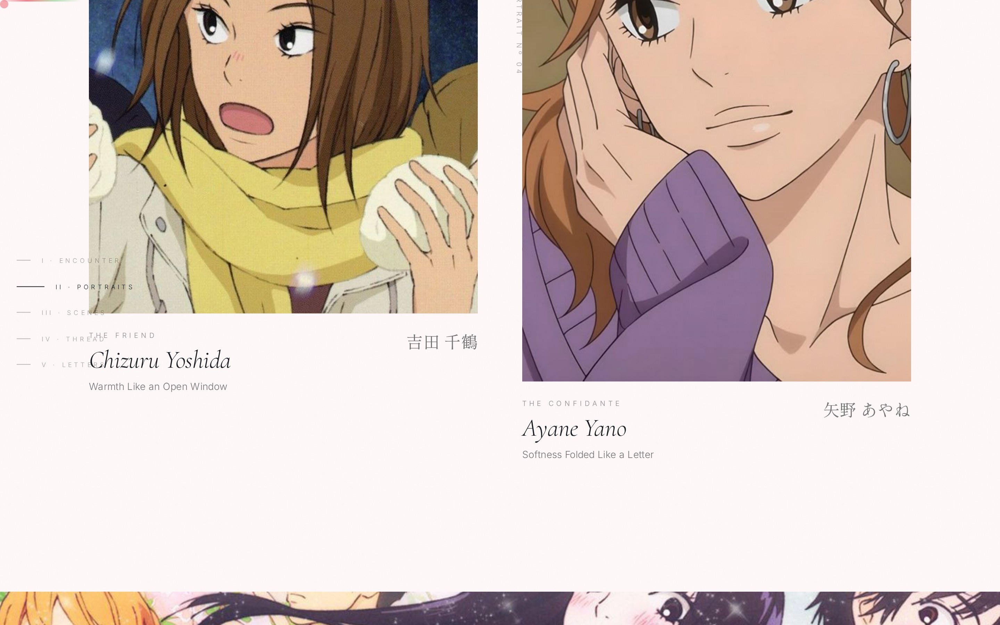

</td>
<td width="50%" valign="top">

### 三 · The Circle — 群像
<sub>*Ensemble frame. Cinematic scale via `useScroll`.*</sub>

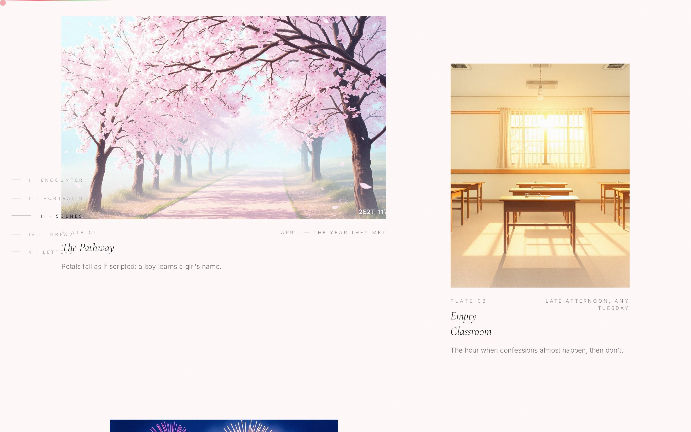

</td>
</tr>
<tr>
<td width="50%" valign="top">

### 四 · Quiet Moments — 静けさ
<sub>*Pathway · classroom · fireworks · snow.*</sub>

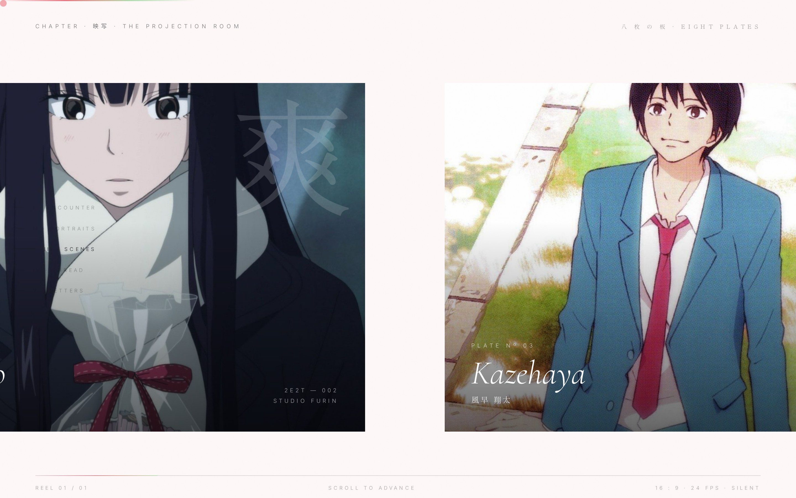

</td>
<td width="50%" valign="top">

### 五 · Projection Room — 映写
<sub>*Vertical scroll pins the frame; the reel passes horizontally.*</sub>

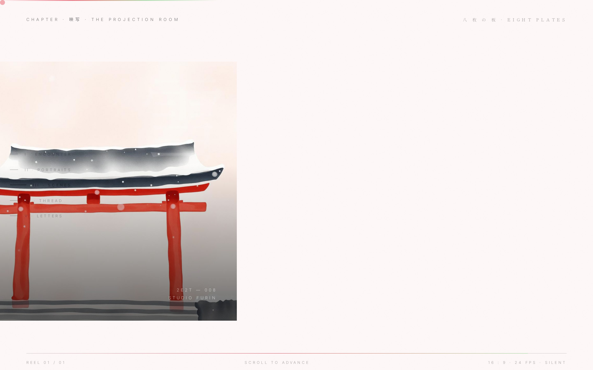

</td>
</tr>
<tr>
<td width="50%" valign="top">

### 六 · Original Ink — 原画
<sub>*Karuho Shiina panels, rotated by the reader's own scroll.*</sub>

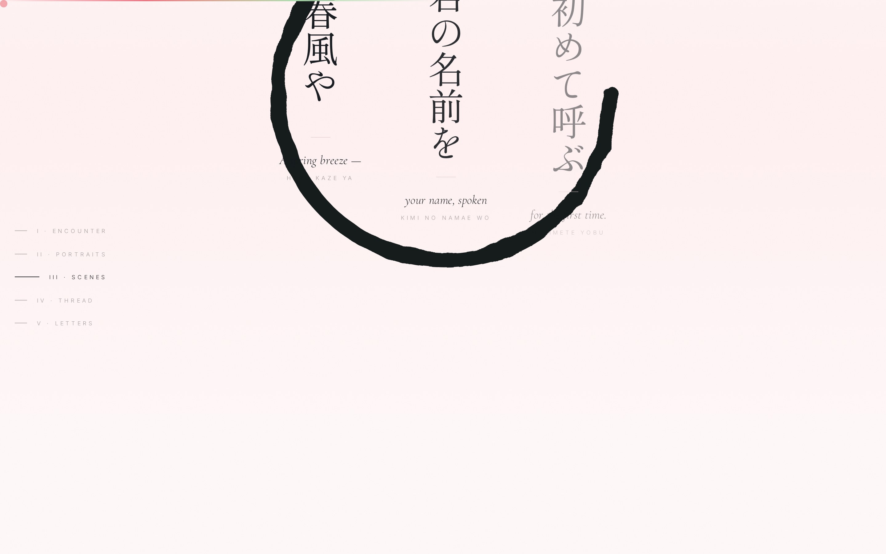

</td>
<td width="50%" valign="top">

### 七 · Haiku — 俳句
<sub>*Vertical-rl Japanese type, bilingual counterpoint.*</sub>

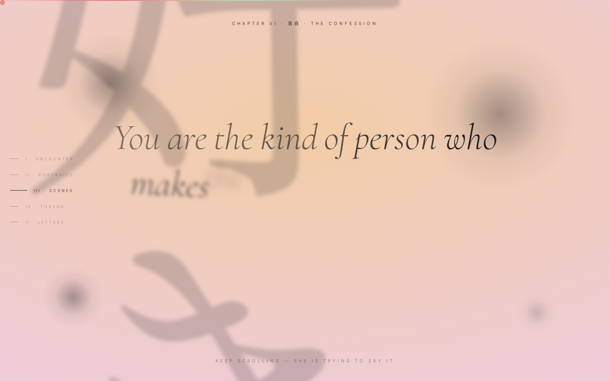

</td>
</tr>
<tr>
<td width="50%" valign="top">

### 九 · Two Weathers — 二季
<sub>*Spring against Winter. A diptych of a single love.*</sub>

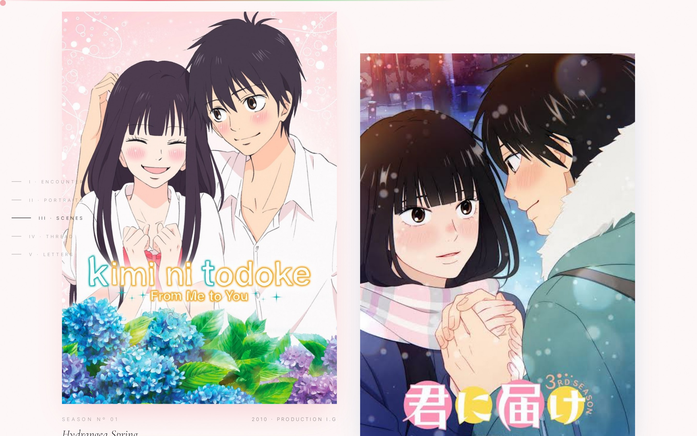

</td>
<td width="50%" valign="top">

### 十 · Postal Archive — 手紙
<sub>*Four postcards that tilt toward the cursor on physics springs.*</sub>

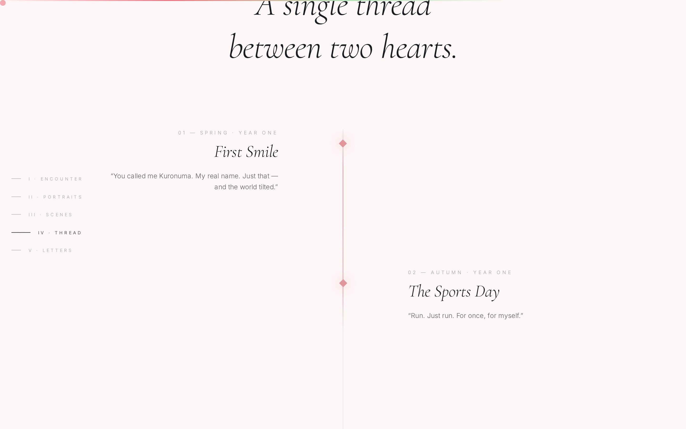

</td>
</tr>
<tr>
<td width="50%" valign="top">

### 十一 · The Thread — 縁
<sub>*A scroll-drawn line stitches four moments across two years.*</sub>

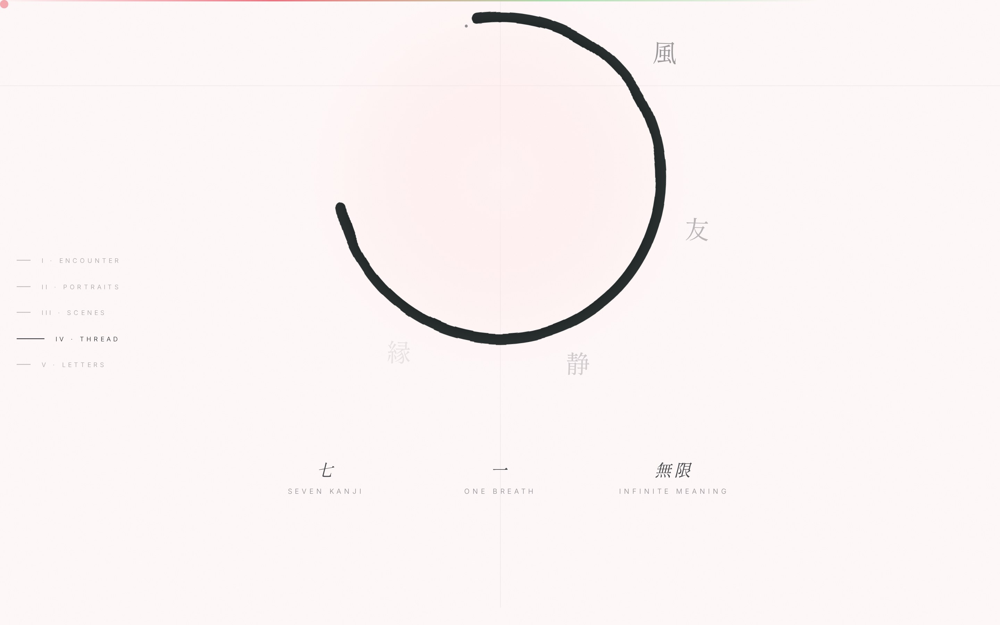

</td>
<td width="50%" valign="top">

### 十三 · Ensō — 円相
<sub>*One breath. One imperfect circle. Seven kanji orbit like stars.*</sub>

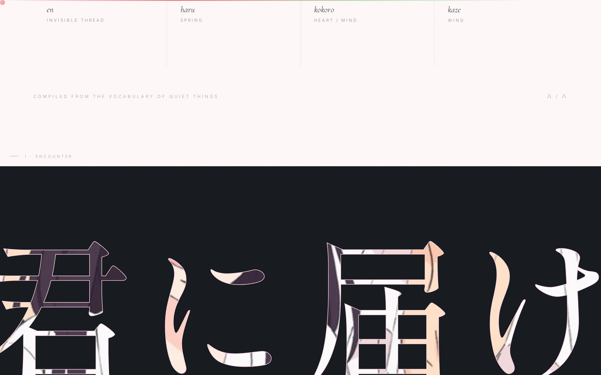

</td>
</tr>
<tr>
<td colspan="2" valign="top">

### 十四 · Kintsugi — 金継ぎ
<sub>*The break is not the flaw. It is the story. Scroll — and gold veins heal the bowl.*</sub>


</td>
</tr>
</table>

<br />

---

## 意匠 — Design Philosophy

This exhibition is built on three principles borrowed from Japanese aesthetics.
They are not decoration. They are the grammar.

<br />

<table>
<tr>
<td align="center" width="33%">

**間**
_ma_

The beauty of<br/>**negative space**.<br/>
The pause between notes.

</td>
<td align="center" width="33%">

**侘寂**
_wabi-sabi_

The elegance of<br/>**imperfection**.<br/>
An ensō drawn in one breath.

</td>
<td align="center" width="33%">

**物の哀れ**
_mono no aware_

The gentle sadness<br/>of **passing things**.<br/>
A petal falling.

</td>
</tr>
</table>

<br />

### 色 — Palette

| Token | OKLCH value | Intent |
|---|---|---|
| `--sakura` | `oklch(0.94 0.04 10)` | Blush of first meeting |
| `--blush` | `oklch(0.90 0.05 15)` | A warmed cheek |
| `--sage` | `oklch(0.78 0.05 145)` | Kazehaya's calm |
| `--ink` | `oklch(0.22 0.01 260)` | Sumi-e brushstroke |
| `--paper` | `oklch(0.98 0.01 90)` | Washi background |
| `--primary` | `oklch(0.75 0.09 15)` | Hanko seal red |

### 字 — Typography

| Face | Use |
|---|---|
| **Cormorant Garamond** | Editorial display — whispered italics |
| **Shippori Mincho** 明朝 | Traditional Japanese letterpress |
| **Homemade Apple** | The handwritten letter |
| **Inter** | Body — held to weight 300, tracked 0.01em |

<br />

---

## 数字 — By the Numbers

<sub>*Measured against the current source tree — not marketing gloss. Run `find src -name '*.tsx' | xargs wc -l` yourself.*</sub>

<br />

<table>
<tr>
<td align="center" width="25%">

### **24**
<sub>Bespoke React components<br/>(excluding shadcn primitives)</sub>

</td>
<td align="center" width="25%">

### **≈ 7.2k**
<sub>Lines of source<br/>(`.ts` / `.tsx` / `.css`, excl. codegen)</sub>

</td>
<td align="center" width="25%">

### **17**
<sub>Named chapters in the<br/>scroll narrative</sub>

</td>
<td align="center" width="25%">

### **19**
<sub>Curated exhibition plates<br/>& watercolour assets</sub>

</td>
</tr>
<tr>
<td align="center">

### **100 / 100**
<sub>Lighthouse Best Practices<br/>on the production build</sub>

</td>
<td align="center">

### **8**
<sub>Kanji in the<br/>*Silent Dictionary*</sub>

</td>
<td align="center">

### **35**
<sub>Ambient petals rendered<br/>per animation frame</sub>

</td>
<td align="center">

### **0**
<sub>Lines of Node server code<br/>— purely edge-ready SSR</sub>

</td>
</tr>
</table>

<br />

| Metric | Value |
|---|---:|
| Framework | **TanStack Start v1 · React 19 · Vite 7** |
| TypeScript mode | **strict** |
| Runtime dependencies | **54** |
| Type-safe file-based routes | **1** (single-page exhibition) |
| Custom `@keyframes` animations | **4** |
| Scroll-linked `useScroll` / `useTransform` chains | **9** |
| Cursor petal-trail throttle | **70 ms** |
| Marquee ribbon loop | **60 s** |
| Character portraits (art-directed) | **4** |
| Postcards with 3D cursor-tilt springs | **4** |
| Milliseconds of joy per scroll | *uncountable* |

<br />

---

## 技法 — Technique

A concise map of what powers each effect.

```text
Prelude          →  framer-motion shoji panels, kanji bloom on mount
Hero             →  per-character stagger blur + canvas PetalField
BreezeCursor     →  custom cursor + rAF-throttled petal spawner
PetalField       →  radial-gradient ellipses on <canvas>,
                    wind vector tracks mousemove
FloatingNav      →  useScroll + useSpring gradient scroll bar
Characters       →  scroll-linked useTransform on each portrait
Ensemble         →  scale + y + opacity via useScroll
HorizontalCinema →  vertical scroll pins the section, x-translate rail,
                    eight oversized plates with kanji watermarks
MangaPanels      →  scroll-driven rotate + y-translate
HaikuInterlude   →  sumi-e ink circles, writing-mode: vertical-rl
ConfessionScene  →  pinned section, breath-timed opacity chapters
SeasonsDiptych   →  Spring · Winter split with parallax
Postcards        →  useMotionValue → useSpring → rotateX / rotateY,
                    shine sweep on hover
Timeline         →  scroll-drawn linear-gradient thread linking milestones
AudioSignature   →  64-bar SVG spectrogram of silence
InkConstellation →  SVG enso drawn via strokeDashoffset,
                    orbiting kanji + hanko seal
Kintsugi         →  gold veins draw across a fractured bowl,
                    six SVG paths healed by scrollYProgress
TextMaskReveal   →  SVG <mask> cuts 君に届け through zooming film
KanjiGlossary    →  8-cell grid, hover-reveal poem + hanko seal
Letters          →  handwritten script, envelope reveal
paper-grain      →  SVG feTurbulence noise, mix-blend-mode: multiply
```

<br />

---

## 起動 — Getting Started

```bash
# 1 — install
bun install

# 2 — enter the exhibition
bun run dev

# 3 — press for the world
bun run build
```

Then open <http://localhost:8080> and scroll — **softly**.

<br />

### 構造 — Project Structure

```
src/
├─ routes/
│  ├─ __root.tsx              ── HTML shell, head metadata, providers
│  └─ index.tsx               ── The single-page exhibition
├─ components/                  ── 23 bespoke components
│  ├─ Prelude.tsx             ── 序 · Opening shoji panels
│  ├─ Hero.tsx                ── 一 · "From Me to You"
│  ├─ Characters.tsx          ── 二 · Four portraits
│  ├─ Ensemble.tsx            ── 三 · The circle
│  ├─ Gallery.tsx             ── 四 · Quiet moments
│  ├─ HorizontalCinema.tsx    ── 五 · The projection room
│  ├─ MangaPanels.tsx         ── 六 · Original ink
│  ├─ HaikuInterlude.tsx      ── 七 · Bilingual haiku
│  ├─ ConfessionScene.tsx     ── 八 · Confession
│  ├─ SeasonsDiptych.tsx      ── 九 · Spring & winter
│  ├─ Postcards.tsx           ── 十 · Postal archive
│  ├─ Timeline.tsx            ── 十一 · The thread
│  ├─ AudioSignature.tsx      ── 十二 · Score of silence
│  ├─ InkConstellation.tsx    ── 十三 · Ensō
│  ├─ KanjiGlossary.tsx       ── 十四 · Silent dictionary
│  ├─ TextMaskReveal.tsx      ── 十五 · The delivery
│  ├─ Letters.tsx             ── 十六 · Letters untold
│  ├─ CuratorsNote.tsx        ── Curator's essay
│  ├─ Marquee.tsx             ── Bilingual phrase ribbon
│  ├─ FloatingNav.tsx         ── Chapter rail + scroll progress
│  ├─ PetalField.tsx          ── Canvas ambient petals
│  ├─ BreezeCursor.tsx        ── Trailing petal cursor
│  └─ Footer.tsx              ── Colophon
├─ assets/                      ── 19 watercolour plates & petal sprite
└─ styles.css                   ── Design tokens, keyframes, paper-grain
```

<br />

---

## 敬意 — With Respect

This is an **unofficial, non-commercial homage** built purely as an aesthetic study.
All rights to *Kimi ni Todoke — From Me to You* belong to **椎名軽穂 (Karuho Shiina)**,
**集英社 (Shueisha)**, **Production I.G**, and their licensors.

Character likenesses and panels appear here in the spirit of quiet appreciation —
the way one might place a favourite postcard on a writing desk.

<br />

---

## 奥付 — Colophon

<div align="center">

<br />

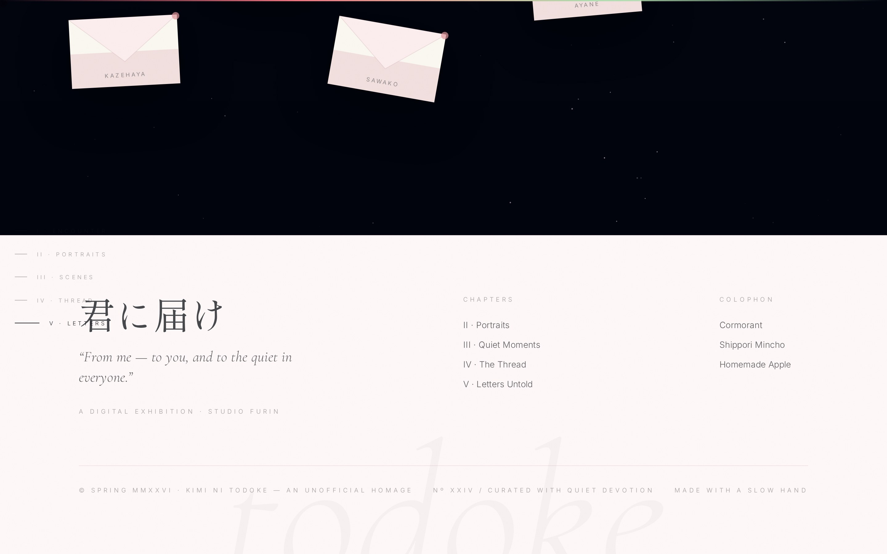

<br />

`⸺  作 · スタジオ 風 鈴  ⸺`

_Designed & built with a slow hand._
Curated as **Exhibition Nº XXIV**, Spring MMXXVI.

<br />

_「君に、届いたら嬉しい。」_
**If this reaches you, I will be glad.**

<br />

<sub>― 完 ―</sub>

</div>
