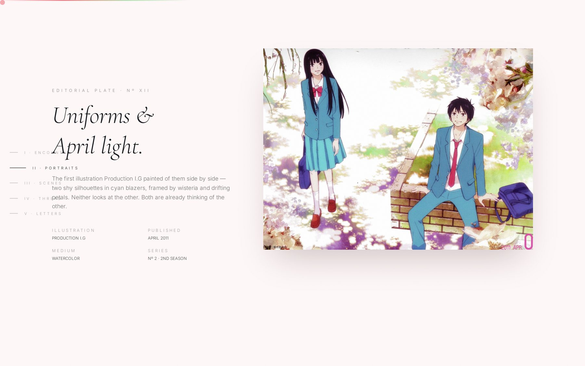
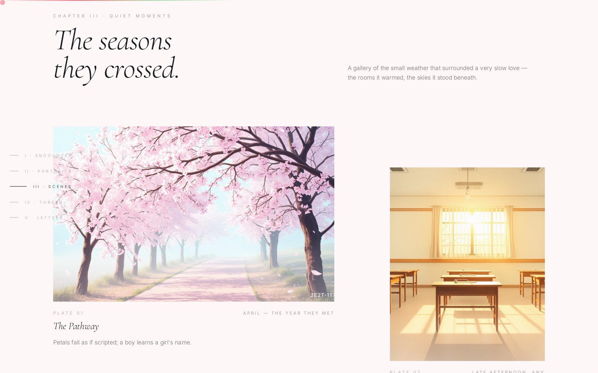
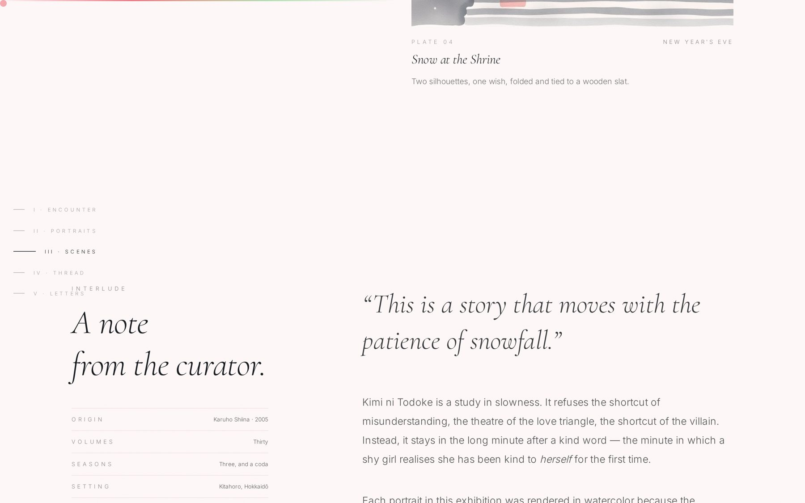

<div align="center">

<br />

# 君に届け

### From Me to You — A Digital Exhibition

_A quiet, editorial homage to the manga & anime_ **Kimi ni Todoke** _by Karuho Shiina._

<br />

`⸺  一 期 一 会  ⸺`

<sub>Ichi‑go ichi‑e · "one time, one meeting" · treat every encounter as unrepeatable.</sub>

<br />


<br />

[](https://react.dev)
[](https://tanstack.com/start)
[](https://tailwindcss.com)
[](https://motion.dev)
[](https://www.typescriptlang.org)

</div>

<br />

---

## 序 — Prologue

> _「普通の女の子になりたい。」_
> _"I only wanted to be an ordinary girl."_ — Sawako Kuronuma

**From Me to You** is not a fan page.
It is a **curated digital museum** — an *aesthetic exhibition* — dedicated to the slow, painterly love story between **Sawako Kuronuma (黒沼 爽子)** and **Shota Kazehaya (風早 翔太)**.

Every scroll is a room. Every section is a plate.
Typography breathes. Petals drift with the cursor.
Nothing shouts. Everything reaches.

<br />

## 目次 — Table of Contents

|   | Chapter | Component | English |
|---|---|---|---|
| **序** | Prelude — 予兆 | `Prelude.tsx` | The shoji panels open |
| **一** | The Encounter — 出会い | `Hero.tsx` | *"From Me to You"* |
| **二** | Portraits — 肖像 | `Characters.tsx` | Four hand-drawn souls |
| **三** | The Circle — 群像 | `Ensemble.tsx` | Cinematic ensemble plate |
| **四** | Quiet Moments — 静けさ | `Gallery.tsx` | Editorial scene stills |
| **五** | Original Ink — 原画 | `MangaPanels.tsx` | Karuho Shiina panels |
| **六** | Haiku Interlude — 俳句 | `HaikuInterlude.tsx` | Vertical bilingual verse |
| **七** | Two Weathers — 二季 | `SeasonsDiptych.tsx` | Spring · Winter diptych |
| **八** | The Thread — 縁 | `Timeline.tsx` | Scroll-linked chronology |
| **九** | A Silent Dictionary — 言葉 | `KanjiGlossary.tsx` | Eight kanji that hold the story |
| **十** | Letters Untold — 手紙 | `Letters.tsx` | The final envelope |

<br />

---

## 展示 — The Exhibition

<br />

### 二 · Portraits — 肖像画

<sub>*Four characters, four watercolour plates, four whispered monologues.*</sub>


<br />

### 三 · The Circle — 群像

<sub>*Cinematic ensemble frame, scroll‑linked scale & opacity via `useScroll`.*</sub>



<br />

### 四 · Quiet Moments — 静けさ

<sub>*An asymmetric editorial grid — the pathway, the classroom, fireworks, snow.*</sub>



<br />

### 八 · The Thread — 縁

<sub>*The invisible thread that binds two people — rendered as a scroll‑drawn line.*</sub>



<br />

---

## 意匠 — Design Philosophy

This exhibition follows three principles borrowed from Japanese aesthetics:

> **間 (ma)** — the beauty of negative space.
> **侘寂 (wabi-sabi)** — the elegance of imperfection.
> **物の哀れ (mono no aware)** — the gentle sadness of passing things.

Nothing is decorative. Every gradient, every serif italic, every falling petal earns its place.

| Token | Value | Intent |
|---|---|---|
| Sakura pink | `oklch(0.94 0.04 10)` | Blush of first meeting |
| Blush | `oklch(0.90 0.05 15)` | Warmed cheek |
| Sage | `oklch(0.78 0.05 145)` | Kazehaya's calm |
| Ink | `oklch(0.22 0.01 260)` | Sumi-e brushstroke |
| Paper | `oklch(0.98 0.01 90)` | Washi background |
| Serif display | **Cormorant Garamond** | Whispered italics |
| Japanese | **Shippori Mincho** 明朝 | Traditional letterpress |
| Script | **Homemade Apple** | The handwritten letter |

<br />

---

## 数字 — By the Numbers

<sub>*Measured against the current source tree — not marketing gloss.*</sub>

| Metric | Value |
|---|---:|
| Bespoke React components (excluding shadcn/ui) | **17** |
| Total lines of source (`.ts` / `.tsx` / `.css`) | **≈ 6.2k** |
| Curated exhibition plates & watercolour assets | **15** |
| Named chapters in the scroll narrative | **10** |
| Characters portrayed | **4** |
| Kanji in the *Silent Dictionary* | **8** |
| CSS design tokens defined in `styles.css` | **20+** |
| Type‑safe routes (TanStack file‑based routing) | **1** |
| Custom `@keyframes` animations | **4** |
| Runtime dependencies | **≈ 60** |
| Ambient falling petals rendered per frame | **35** |
| Cursor petal trail throttle | **70 ms** |
| Marquee loop duration | **60 s** |
| TypeScript strict mode | **on** |
| Framework | **TanStack Start v1 + React 19** |
| Node server code | **0 lines** — purely static, edge-ready |

<br />

---

## 技法 — Technique

A concise map of what powers each effect.

```
Prelude          →  Framer Motion — shoji panels slide, kanji blooms
Hero             →  Per-character stagger blur + Canvas petal field
BreezeCursor     →  Custom cursor + throttled petal spawner (rAF)
PetalField       →  requestAnimationFrame, radial-gradient ellipses,
                    wind vector tracks mousemove
FloatingNav      →  useScroll + useSpring for the gradient scroll bar
Characters       →  Scroll-linked useTransform on each portrait
Ensemble         →  Scale + y + opacity via useScroll (cinematic reveal)
HaikuInterlude   →  Sumi-e ink circles, vertical-rl Japanese type
MangaPanels      →  Scroll-driven rotation + y-translate on panels
Timeline         →  Scroll-drawn thread linking chronological moments
KanjiGlossary    →  8-cell grid, hover-reveal poem + hanko seal
Letters          →  Handwritten script closing envelope
paper-grain      →  SVG feTurbulence noise, mix-blend-mode: multiply
```

<br />

---

## 起動 — Getting Started

```bash
# 1 — install
bun install

# 2 — enter the exhibition
bun run dev

# 3 — press for the world
bun run build
```

Then open <http://localhost:8080> and scroll — **softly**.

<br />

### 構造 — Project Structure

```
src/
├─ routes/
│  ├─ __root.tsx          ── HTML shell, head metadata, providers
│  └─ index.tsx           ── The single-page exhibition
├─ components/
│  ├─ Prelude.tsx         ── 序 · Opening shoji panels
│  ├─ Hero.tsx            ── 一 · "From Me to You"
│  ├─ Characters.tsx      ── 二 · Four portraits
│  ├─ Ensemble.tsx        ── 三 · The circle
│  ├─ Gallery.tsx         ── 四 · Quiet moments
│  ├─ MangaPanels.tsx     ── 五 · Original ink
│  ├─ HaikuInterlude.tsx  ── 六 · Bilingual haiku
│  ├─ SeasonsDiptych.tsx  ── 七 · Spring & winter
│  ├─ Timeline.tsx        ── 八 · The thread
│  ├─ KanjiGlossary.tsx   ── 九 · A silent dictionary
│  ├─ Letters.tsx         ── 十 · Letters untold
│  ├─ CuratorsNote.tsx    ── Curator's essay
│  ├─ Marquee.tsx         ── Bilingual phrase ribbon
│  ├─ FloatingNav.tsx     ── Chapter rail + scroll progress
│  ├─ PetalField.tsx      ── Canvas ambient petals
│  ├─ BreezeCursor.tsx    ── Trailing petal cursor
│  └─ Footer.tsx          ── Colophon
├─ assets/                ── 15 watercolour plates & petal sprite
└─ styles.css             ── Design tokens, keyframes, paper-grain
```

<br />

---

## 敬意 — With Respect

This is an **unofficial, non-commercial homage** built purely as an aesthetic study.
All rights to *Kimi ni Todoke — From Me to You* belong to **椎名軽穂 (Karuho Shiina)**,
**集英社 (Shueisha)**, **Production I.G**, and their licensors.

Character likenesses and panels appear here in the spirit of quiet appreciation,
the way one might place a favourite postcard on a desk.

<br />

## 奥付 — Colophon

<div align="center">

<br />

`⸺  作 · スタジオ 風鈴  ⸺`

Designed & built with a slow hand.
Curated as **Exhibition Nº XXIV**, Spring MMXXVI.

<br />

_「君に、届いたら嬉しい。」_
**If this reaches you, I will be glad.**

<br />

</div>
